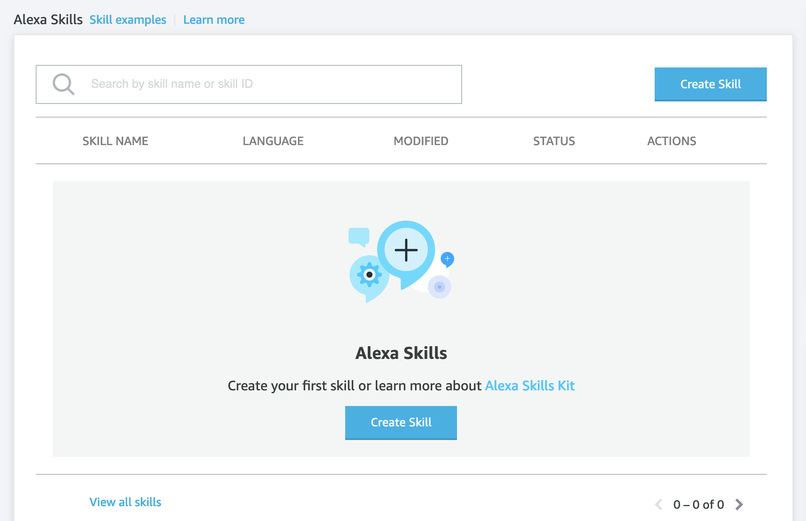
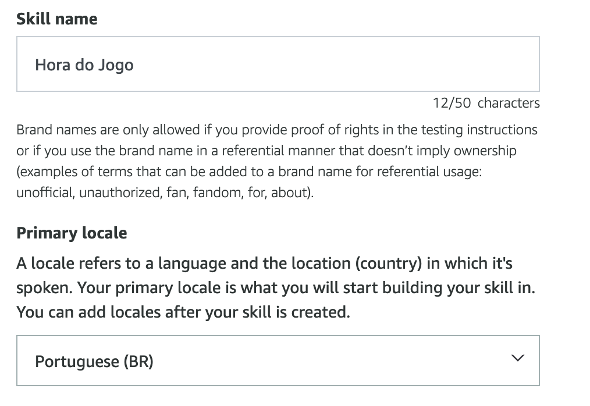
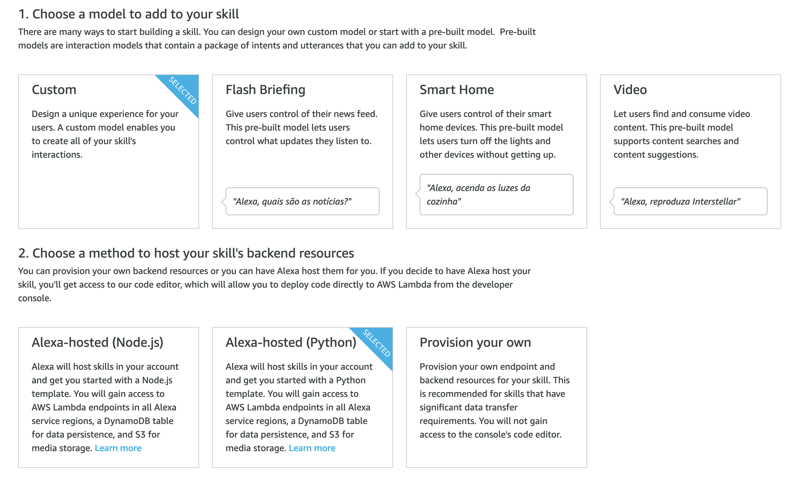
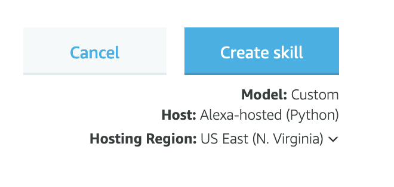
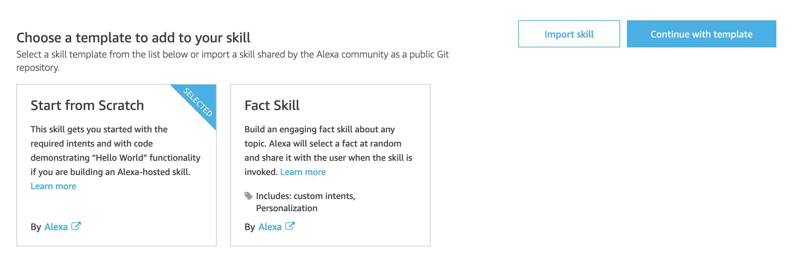
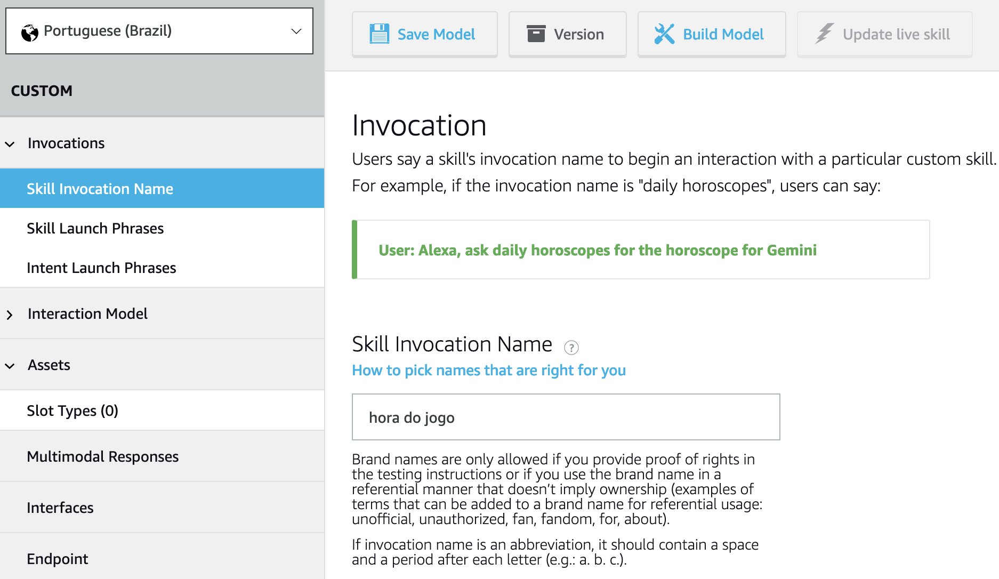

## Módulo 1 - Construindo a sua primeira skill

O que você vai aprender neste módulo:  

-   Como construir uma skill chamada "Hora do Jogo" usando a Alexa Developer Console
-   Como adicionar uma saudação como resposta
-   Como testar sua habilidade

  

### Criando sua primeira Alexa skill

1.  Para começar, você precisa fazer login na conta de desenvolvedor da Amazon e acessar a console da Alexa.
<br>


2.  [Abra a página de login do](https://developer.amazon.com/alexa/console/ask) console do desenvolvedor Alexa , insira as credenciais da sua conta de desenvolvedor da Amazon e clique em **Login**.


> Se você não tiver uma conta de desenvolvedor da Amazon, consulte este link para [Criar sua conta de desenvolvedor da Amazon](https://developer.amazon.com/en-US/docs/alexa/ask-overviews/create-developer-account.html).
<br>

3.  Após fazer logon, no canto superior direito do console do desenvolvedor, clique em **Create Skill**.
<br>



<br>

4.  No campo **Skill name**, insira **Hora do Jogo** e campo **Primary locale**, selecione **Portuguese (BR)**.
<br>



<br>

5. Em **1. Choose a model to add to your skill**, selecione **Custom** e em **2. Choose a method to host your skill's backend resources** selecione Alexa-hosted (Python).
<br>



<br>

6. No canto superior direito da página, clique em **Create skill**.
<br>




7. Em **Choose a template to add to your skill**,  selecione **Start from Scratch** e clique em **Continue with template** (localizado no canto superior direito da página).
<br>



<br>
8.  Quando o processo for concluído, você será direcionado para a guia **Build** de sua habilidade recém-criada.
<br>

### Altere o nome para invocação da skill
<br>

Para começar a configurar uma skill a primeira etapa é atualizar o nome para invocação.  
<br>

9.  No Alexa Developer Console, ainda na guia **Build** , no menu à esquerda, clique em **Invocations** e **Skill Invocation Name**.
<br>

10.  Altere o valor do campo **Skill Invocation Name** para **hora do jogo**.
<br>



<br>
11.  Na parte superior da página, clique em **Save model** e depois em **Build model**.
<br>

### Modifique o código da skill
<br>

12.  Na Alexa Developer Console, clique na guia **Code**. O editor de código abre o arquivo **lambda_function.py**.
<br>

Existem duas funções para um handler, `can_handle()` e `handle()`. A função `can_handle()` é onde você define a quais solicitações o handler responde e a função `handle()` retorna uma resposta ao usuário.  
<br>

Sempre que sua skill receber uma solicitação, a função `can_handle()` determinará se esse handler pode ou não atender à solicitação em cada uma das classes.  
<br>

Nesse caso, o usuário deseja iniciar a skill, que é uma requisição do tipo **LaunchRequest**. Portanto, a função `can_handle()` dentro da classe **LaunchRequestHandler** retornará **true**, confirmando que a função `handle()` (dentro da classe **LaunchRequestHandler**) pode ser executada.  
<br>  

13.  Dentro da classe `LaunchRequestHandler`, localize a função `handle()` e a linha que começa com `speak_output =`.
<br>

14.  Substitua essa linha pela seguinte linha.
<br>

```
speak_output = "Olá, bem-vindo ao Jogo da Educação, sua primeira skill da Alexa, até logo!"
```

<br>
Ainda dentro da classe `LaunchRequestHandler`, observe que variável `speak_output`, que você definiu anteriormente é utilizada pela função `.speak()`, ela diz ao `response_builder` para falar o valor de `speak_output` para o usuário.  
<br>

15.  Localize a linha que começa `.ask()`e insira um sinal de sustenido (#) no início da linha. Isso transforma a linha em um comentário, o que significa que a linha será ignorada quando o código for executado.
<br>

  
> Nota: Certifique-se de modificar apenas na classe `LaunchRequestHandler`, dentro da função `handle()`.
<br>

Se você quiser que a habilidade escute a resposta do usuário, use A função `.ask()` é para que a skill escute a resposta do usuário, nesse caso, você quer que a skill fale e saia, portanto, vamos manter comentada esta linha de código.  
<br>  


16.  Após realizar essas modificações o seu código deve ficar assim;
<br>

```
class LaunchRequestHandler(AbstractRequestHandler):  
    """Handler for Skill Launch."""  
    def can_handle(self, handler_input):  
        # type: (HandlerInput) -> bool  
        return ask_utils.is_request_type("LaunchRequest")(handler_input)  
  
    def handle(self, handler_input):  
        # type: (HandlerInput) -> Response  
        speak_output = "Olá, bem-vindo ao Jogo da Educação, sua primeira skill da Alexa, até logo!"  
        return (  
            handler_input.response_builder  
                .speak(speak_output)  
                #.ask(speak_output)  
                .response  
        )
```
<br>
17.  Na parte superior da tela, clique em **Save** e depois **Deploy**.
<br>

### Teste sua skill
<br>

Agora é hora de testar a skill que você construiu. Comece ativando o simulador de teste.  
<br>

18.  Clique na guia **Test.** O simulador de teste é aberto.
<br>

> **Nota:** Um alerta pode aparecer solicitando que você use o microfone do seu computador. Clique em **Permitir** para habilitar o teste da skill com sua voz, como se estivesse falando com um dispositivo habilitado para Alexa.
<br>

19.  No canto superior esquerdo da página, no menu suspenso ao lado de **Test is disabled for this skill**, selecione **Development**.
<br>

20.  Há duas maneiras de testar sua habilidade no console do desenvolvedor:

-   Digite **abrir hora do jogo** (não adicione nenhum artigo à frente do nome de invocação da skill) e pressione **ENTER**
-   Fale com a skill, clique e segure o **ícone do microfone** e diga "abrir hora do jogo".
<br>
