## Módulo 2 - Adicionando habilidades de conversação (intents e slots)

O que você vai aprender neste módulo:  

-   Como criar novas intents em sua skill
-   Como criar slots padrões e personalizados para armazenar respostas
-   Como usar enunciados (_Utterance_), intents, slots e delegação automática para obter as respostas necessárias
-   Como criar um novo handler para responder às informações recebidas

#### Adicione uma intent "sim" e ative o Alexa Presentation Language (APL)

1.  No console do desenvolvedor, clique na guia **Build** e, no menu à esquerda, clique em **Interaction Model** e, em seguida, clique em **Intents**.
<br>

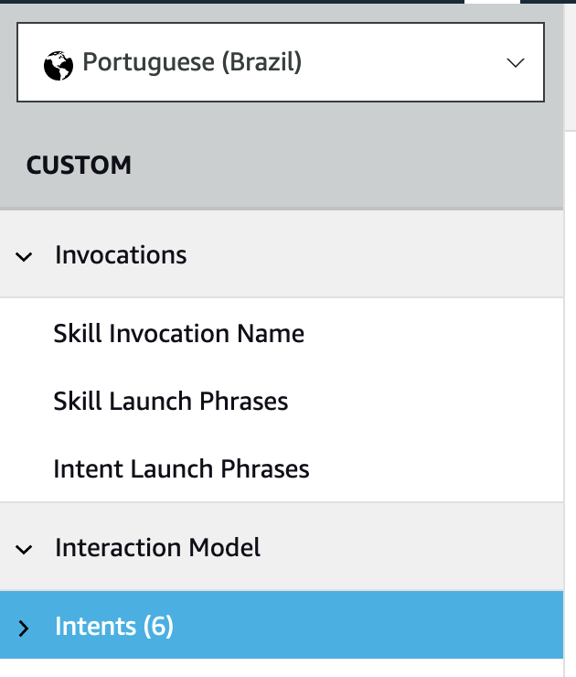
<br>

2. No painel direito, em **Intents** , clique no botão **+Add Intent** . Na página **Add Intent** , você pode criar um intent personalizado ou usar um intent existente da biblioteca integrada.
<br>

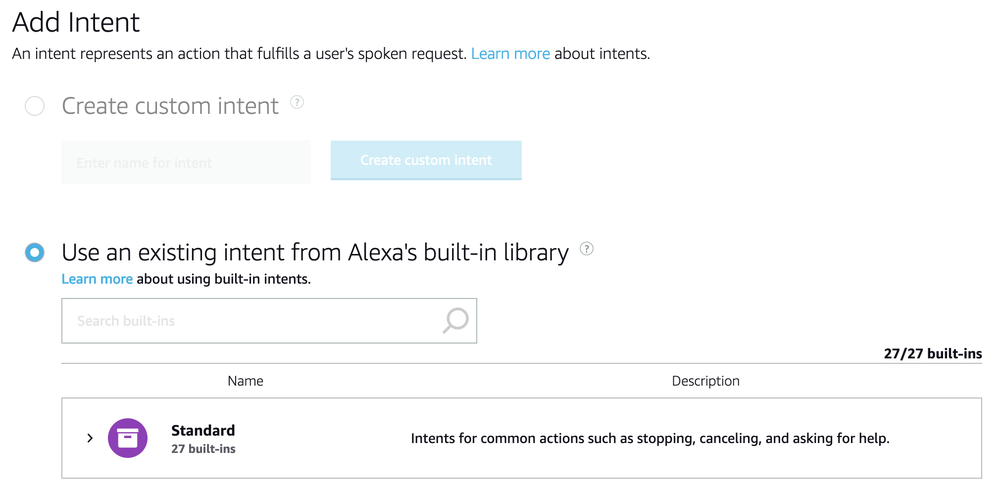
<br>

3.  Na caixa de pesquisa, digite "yes" para encontrar a intent.
<br>

4.  Na linha **AMAZON.YesIntent** , clique em **+ Add Intent** e, em seguida, clique em **view**. Agora você verá o **AMAZON.YesIntent** na sua lista de intents.
<br>

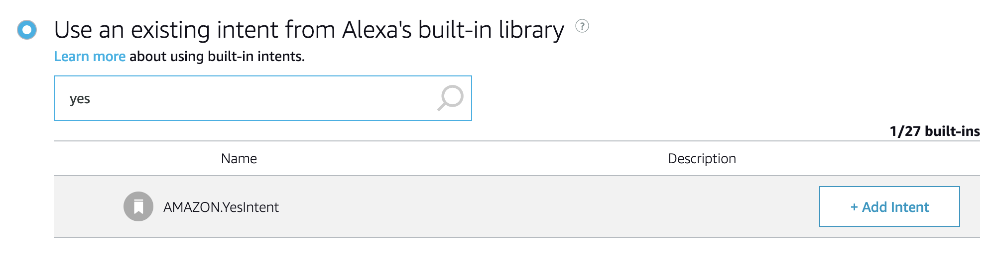
<br>

5.  Na parte superior da página, clique em **Save model**.
<br>

6.  No menu à esquerda, clique em **Interfaces**.
<br>

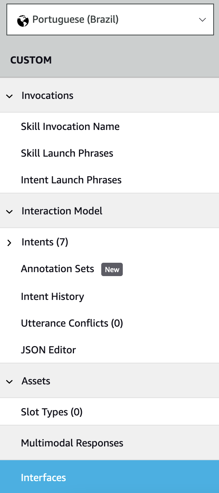
<br>

7. No painel direito, role para baixo até **Alexa Presentation Language** e clique para alternar na interface, expandirá as opções para mostrar todos os perfis disponíveis.
<br>

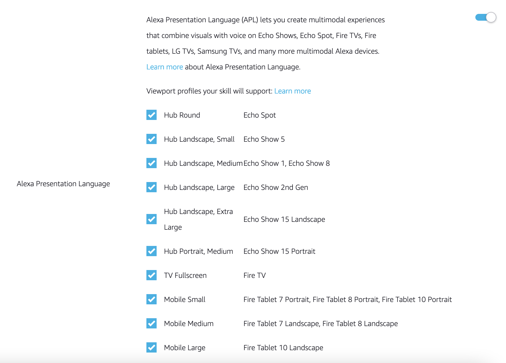
<br>

8.  Na parte superior da página, clique em **Save interfaces** e depois clique em **Build Model.**
<br>

#### Atualize o handler LaunchIntent para exibir um texto e interagir de forma visual
<br>

9.  Clique na guia **Code.**
<br>

10.  Na navegação de arquivos à esquerda, em **Skill Code,** clique em **lambda** para selecionar a pasta. Em seguida, clique em **New Folder**. Em seguida, digite "lambda/documents" em **Folder Path** e clique em **Create Folder** .
<br>

11.  Clique na pasta **documents** criada na etapa anterior e depois clique em **New file**. Insira "lambda/documents/APL_simple.json" em **File Path** e clique em **Create File**. Uma nova guia será aberta.
<br>

12.  Cole o código abaixo e clique em **Salvar**.

```
{ "type": "APL", "version": "1.8", "license": "Copyright 2021 Amazon.com, Inc. or its affiliates. All Rights Reserved.\nSPDX-License-Identifier: LicenseRef-.amazon.com.-AmznSL-1.0\nLicensed under the Amazon Software License http://aws.amazon.com/asl/", "settings": {}, "theme": "dark", "import": [ { "name": "alexa-layouts", "version": "1.4.0" } ], "resources": [], "styles": {}, "onMount": [], "graphics": {}, "commands": {}, "layouts": {}, "mainTemplate": { "parameters": [ "payload" ], "items": [ { "type": "AlexaHeadline", "primaryText": "${payload.myData.Title}", "secondaryText": "${payload.myData.Subtitle}" } ] } } 
```
<br>

13.  Em seguida, clique novamente na guia `lambda_function.py` e localize a variável `speak_output` dentro da classe `LaunchRequestHandler` que deve estar assim;
<br>

```
speak_output = "Olá, bem-vindo ao Jogo da Educação, sua primeira skill da Alexa, até logo!"
```
<br>

14.  No lugar dessa string, copie e cole o novo texto a seguir do script.
<br>

```
speak_output = f"Bem-vindo ao Jogo da Educação. " \  
	f"Eu vou te falar o nome de uma celebridade e " \  
	f"você vai tentar advinhar a data de nascimento. " \  
	f"Vamos ver quantas você acerta! " \  
	f"Pronto para começar? "
```
<br>

15.  Após o código que você acabou de copiar e colar, encontre o trecho de código abaixo.
<br>

```
return (
            handler_input.response_builder
                .speak(speak_output)
                #.ask(speak_output)
                .response
        )
```
<br>

16.  Substitua o código acima pelo código a seguir;
<br>

```
        #====================================================================
        # Add a visual with Alexa Layouts
        #====================================================================
        # Import an Alexa Presentation Language (APL) template
        with open("./documents/APL_simple.json") as apl_doc:
            apl_simple = json.load(apl_doc)
            if ask_utils.get_supported_interfaces(
                    handler_input).alexa_presentation_apl is not None:
                handler_input.response_builder.add_directive(
                    RenderDocumentDirective(
                        document=apl_simple,
                        datasources={
                            "myData": {
                                #====================================================================
                                # Set a headline and subhead to display on the screen if there is one
                                #====================================================================
                                "Title": 'Diga "sim."',
                                "Subtitle": 'Jogar a Hora do Jogo.',
                            }
                        }
                    )
                )
        
        return (
            handler_input.response_builder
                .speak(speak_output)
                .ask(speak_output)
                .response
        )

```
<br>

17.  Na parte superior do arquivo, encontre a linha a seguir.
<br>

```
import ask_sdk_core.utils as ask_utils
```
<br>

18.  Adicionei abaixo dessa linha o seguinte código;
<br>

```
import json  
from ask_sdk_model.interfaces.alexa.presentation.apl import (  
RenderDocumentDirective)
```
<br>

19.  Na parte superior da página, clique em **Save** e depois em **Deploy.**
<br>

20.  Clique na guia **Test** e digite "abrir **hora do jogo**" ou interaja através do microfone.
<br>

#### Adicione um manipulador Yes Intent com conteúdo simples
<br>

21.  Copie as linhas de código que definem a classe `LaunchRequestHandler` e cole abaixo, antes do início da classe `HelloWorldIntentHandler`.
<br>

22.  Altere o nome da claase que você colou de `LaunchRequestHandler` para `PlayGameHandler`.
<br>

> Por que você não o nomeia YesIntentHandler? Duas razões:

> 1 - Os nomes dos handlers não precisam corresponder aos nomes dos intents que eles manipulam.

> 2 - Você pode ter clientes dizendo "sim" para coisas diferentes e pode querer ter handlers diferentes dependendo do contexto. No próximo módulo, mostraremos como lidar com isso.

<br> 

23.  Localize o trecho de código abaixo para ajustar o método `can_handle()` ainda dentro da classe `PlayGameHandler`;
<br>

```
return ask_utils.is_request_type("LaunchRequest")(handler_input)
```
<br>

24.  Substitua o código acima pelo trecho abaixo;
<br>

```
return (
        ask_utils.is_request_type("IntentRequest")(handler_input)
            and ask_utils.is_intent_name("AMAZON.YesIntent")(handler_input)
)
```
<br>

Esse novo código verificará se o tipo de solicitação é um **IntentRequest** em vez de um **LaunchRequest** e, em seguida, verificará se o nome da intenção é **AMAZON.YesIntent**.  
  
No código a seguir, atualize as strings **speak output** , **title** e **subtitle** conforme o código abaixo.  
<br>
 

```
def handle(self, handler_input):
        # type: (HandlerInput) -> Response
        speak_output =  f"OK, então vamos jogar!"

        #====================================================================
        # Add a visual with Alexa Layouts
        #====================================================================
        # Import an Alexa Presentation Language (APL) template
        with open("./documents/APL_simple.json") as apl_doc:
            apl_simple = json.load(apl_doc)
            if ask_utils.get_supported_interfaces(
                    handler_input).alexa_presentation_apl is not None:
                handler_input.response_builder.add_directive(
                    RenderDocumentDirective(
                        document=apl_simple,
                        datasources={
                            "myData": {
                                #====================================================================
                                # Set a headline and subhead to display on the screen if there is one
                                #====================================================================
                                "Title": 'Você disse "sim"!',
                                "Subtitle": 'Prepare-se para começar...',
                            }
                        }
                    )
                )
        
        return (
            handler_input.response_builder
                .speak(speak_output)
                .ask(speak_output)
                .response
        )

```
<br>

Agora que você adicionou um novo handler, você precisa _registrá_ -lo. Isso significa que você precisa adicionar o novo handler à lista de testes quando uma solicitação for recebida.  
<br>

25.  Na parte inferior do arquivo `lambda_function.py`, localize a lista de handlers e adicione o `PlayGameHandler`. O código deve ficar assim;
<br>

```
sb = SkillBuilder()

sb.add_request_handler(LaunchRequestHandler())
sb.add_request_handler(PlayGameHandler())
sb.add_request_handler(HelloWorldIntentHandler())
sb.add_request_handler(HelpIntentHandler())
sb.add_request_handler(CancelOrStopIntentHandler())
sb.add_request_handler(FallbackIntentHandler())
sb.add_request_handler(SessionEndedRequestHandler())
sb.add_request_handler(IntentReflectorHandler()) # make sure IntentReflectorHandler is last so it doesn't override your custom intent handlers

sb.add_exception_handler(CatchAllExceptionHandler())

lambda_handler = sb.lambda_handler()
```
<br>

26.  Clique em **Save** e, em seguida, clique em **Deploy** para implantar seu código e depois teste sua skill.
<br>

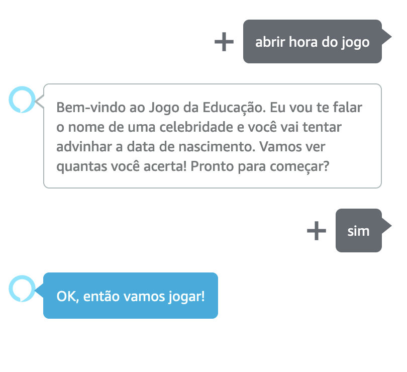
<br>

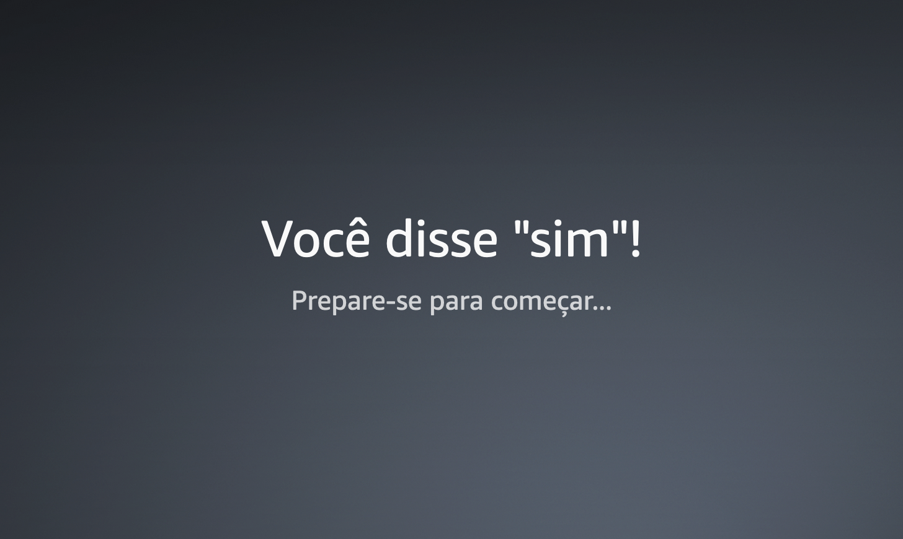

<br>

#### Adicione uma intenção GetBirthday personalizada com slots personalizados e delegação de diálogo
<br>

27.  No console do desenvolvedor, clique na guia **Build**.
<br>

28.  No menu à esquerda, clique em **Interaction Model** e depois em **Intents**.
<br>

29.  No painel direito, em **Intents**, clique no botão **+Add Intent**.
<br>

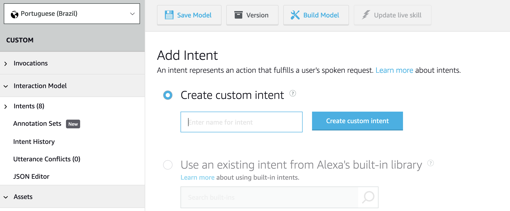
<br>

30. Selecione o botão de opção **Create custom intent,** insira **GetBirthdayIntent** e clique no botão **Create custom intent**.
<br>

> **Nota:** Para criar um modelo de interação, você define solicitações (intents) e enunciados de amostra (utterances). _Enunciados de amostra_ são coisas que seu usuário pode dizer. Por exemplo, seu usuário pode dizer "Ele nasceu em novembro de 1973" ou apenas "Novembro de 1973". Você precisará inserir uma lista com as possíveis respostas à pergunta de aniversário. As palavras ou frases do enunciado podem ser associadas a variáveis. Por exemplo, em vez de "Novembro de 1973", você usaria "{month} de {year}". Em vez de "Ele nasceu em novembro de 1973", você usaria "Ele nasceu em {month} de {year}".
<br>

31.  Na caixa de texto abaixo de **Sample Utterances**, digite **`{month} de {year}`**.
<br>

32.  Clique no **sinal de mais (+)** à direita da tela para adicionar seus slots.
<br>

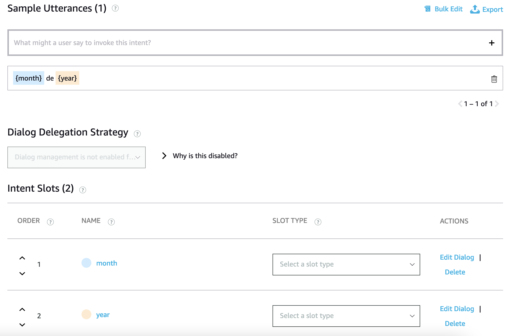
<br>

> Dica: Como escrever enunciados de amostra  
>   
> Uma ótima maneira de criar enunciados de amostra é encenar as respostas. Junte alguns aniversários de celebridades e depois saia e faça perguntas a amigos, familiares ou colegas de trabalho. Simule como se você fosse a Alexa e eles o jogador, anote as respostas e insira as sentenças na sua Skill. Alguns exemplo de respostas  
> - Ah, ela nasceu em {month} de {year}  
> - Acho que foi em {month} de {year}

> - Essa eu sei, foi {month} de {year}  
> - O ano é {year} mas o mês eu acho que foi {month}

> - Essa é fácil, com certeza {month} de {year}  
>   
> Observe que as pessoas reformulam a resposta ("ela nasceu em"). As pessoas adicionam informações pessoais ("Essa eu sei "). As pessoas se posicionam ("Essa é fácil"). Quanto mais enunciados de amostra você fornecer, mais maneiras a Alexa terá de reconhecer o que o usuário está tentando responder.

<br>

33.  Na caixa de texto **Sample Utterances**, adicione os slots individuais sozinhos. Adicione um enunciado de amostra de apenas **{month}**. Em seguida, adicione um enunciado de amostra de apenas **{year}**. Às vezes, você receberá uma resposta incompleta e a Alexa ainda precisa saber que pertence a essa intent.
<br>

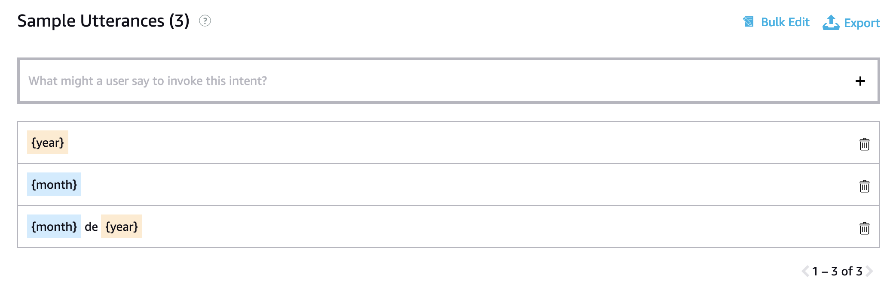
<br>

34.  Role a página para baixo para ver a seção **Intent Slots** que lista os slots que você criou.
<br>

35.  Na linha de **month**, clique no menu **Select a slot type** e digite **Month**. Essa ação retorna um tipo de slot integrado da Amazon, **AMAZON.Month**.
<br>

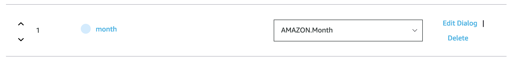
<br>

36.  Na linha de **Year**, clique no menu **Select a slot type** e digite **four**. Essa ação retorna um tipo de slot integrado da Amazon, **AMAZON.FOUR_DIGIT_NUMBER**.
<br>

37.  Role de volta até a parte superior da tela e clique em **Save Model** para salvar seu trabalho até aqui.
<br>

38.  Ainda em **Intents/GetBirthdayIntent**, desça até a seção **Intent Slots e** localize a linha de **month**.
<br>

39.  Na coluna **ACTIONS**, clique no link **Edit Dialog.**
<br>

40.  Em **Slot Filling**, clique no botão de opção ao lado de **Is this slot required to fulfill the intent?** para ativá-lo. Duas novas caixas são exibidas: **Alexa speech prompts** e **User utterances**.
<br>

41.  Insira prompts e enunciados para fornecer várias maneiras pelas quais você deseja que o Alexa solicite as informações e as maneiras pelas quais você prevê que os usuários possam responder.
<br>

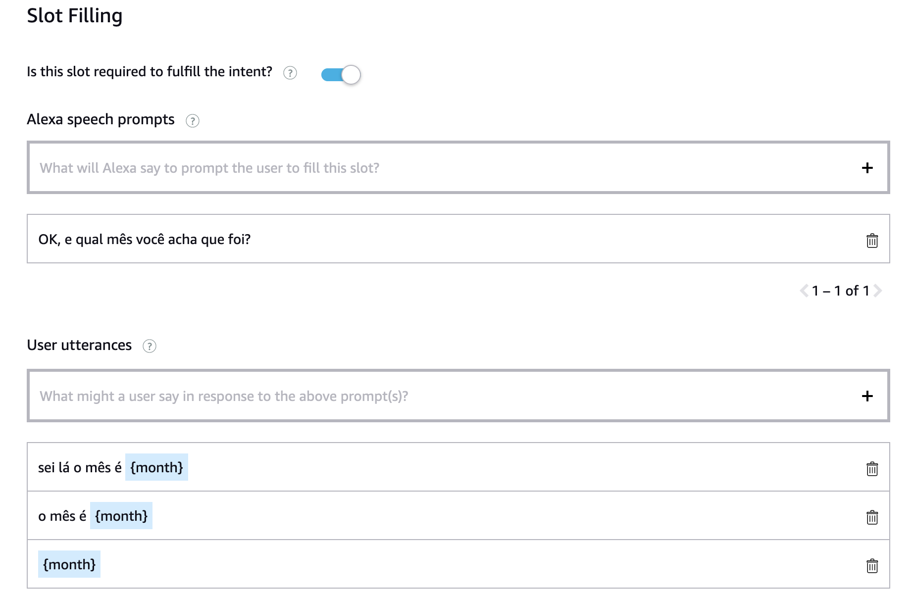
<br>

42.  Quando terminar de adicionar a pergunta e os exemplos de enunciado, role até a parte superior da tela, clique em **Save Model,** volte à página **Intents/GetBirthdayIntent** e execute as mesmas etapas com o intent slot **year**.
<br>

43.  Quando terminar, clique em **Save Model** novamente e retorne à página **Intents/GetBirthdayIntent.**
<br>

44.  No menu **Dialog Delegation Strategy**, selecione **enable auto delegation**. Essa configuração permite que a Alexa faça perguntas para que todos os slots necessários sejam preenchidos.
<br>

45.  Clique em **Save Model** e depois em **Build Model**. A etapa de compilação pode levar alguns minutos.
<br>

#### Atualize o PlayGameHandler para fazer uma pergunta do quiz
<br>

46.  Clique na guia **Code** da Alexa Developer Console
<br>

47.  Na navegação de arquivos à esquerda, em **Skill Code,** clique em **lambda** para selecionar a pasta. Em seguida, clique em **New File**. Em seguida, digite "lambda/celebrityFunctions.py" e clique em **Create file**. Uma nova guia no editor será aberta chamada **celebridadeFunctions.py**. Cole o código abaixo;
<br>

```
# Copyright 2021 Amazon.com, Inc. or its affiliates. All Rights Reserved.
# SPDX-License-Identifier: LicenseRef-.amazon.com.-AmznSL-1.0
# Licensed under the Amazon Software License http://aws.amazon.com/asl/

import json
import random
import datetime
import pytz

CELEBS = []
MONTHS = {"janeiro": 1, "fevereiro": 2, "março": 3, "abril": 4, "maio": 5, "junho": 6, "julho": 7, "agosto": 8, "setembro": 9, "outubro": 10, "novembro": 11, "dezembro": 12}

with open("./documents/birthday.json") as birthday_doc:
    CELEBS = json.load(birthday_doc)

def get_random_celeb(past_celebs = []):
    remaining = [d for d in CELEBS if d not in past_celebs]
    if len(remaining) > 0:
        random.shuffle(remaining)
        return remaining[0]
    else:
        return {
            "id": 0,
            "name": None,
            "birthday": None
        }

def check_answer(current_celeb, month, year):
    d = datetime.datetime.strptime(current_celeb["birthday"], '%Y-%m-%d')
    return d.month == MONTHS[month.lower()] and d.year == int(year)

def get_hour(user_time_zone):
    d = datetime.datetime.now(pytz.timezone(user_time_zone))
    return d.hour
```
<br>

48.  Na navegação de arquivos à esquerda, em **Skill Code**, clique duas vezes para abrir `requirements.txt`. Adicione uma nova linha na parte inferior do arquivo para que o conteúdo fique como o código abaixo e clique em **Save**
<br>

```
boto3==1.9.216
ask-sdk-core==1.11.0
pytz
```
<br>

49.  Clique na pasta de **documents** para selecioná-la**.** Em seguida, clique em **New File**. Em seguida, digite "lambda/documents/birthday.json" em **File Path** e clique em **Create File**. Uma nova guia no editor será aberta chamada **birthday.json**.
<br>

50.  Cole o seguinte documento JSON nesta nova guia chamada **birthday.json** e clique em **Salvar**

```
[ {"id":1, "name":"Kevin Bacon", "birthday":"1958-07-08"}, {"id":2, "name":"Antonio Banderas", "birthday":"1960-08-10"}, {"id":3, "name":"Pierce Brosnan", "birthday":"1953-05-16"}, {"id":4, "name":"Sandra Bullock", "birthday":"1964-07-26"}, {"id":5, "name":"Steve Buscemi", "birthday":"1957-12-13"}, {"id":6, "name":"Nicolas Cage", "birthday":"1964-01-07"}, {"id":7, "name":"Jim Carrey", "birthday":"1962-01-17"}, {"id":8, "name":"George Clooney", "birthday":"1961-05-06"}, {"id":9, "name":"Sean Connery", "birthday":"1930-08-25"}, {"id":10, "name":"Leonardo DiCaprio", "birthday":"1974-11-11"}, {"id":11, "name":"Samuel L. Jackson", "birthday":"1948-12-21"}, {"id":12, "name":"Jennifer Lopez", "birthday":"1969-07-24"}, {"id":13, "name":"Keanu Reeves", "birthday":"1964-09-02"}, {"id":14, "name":"Robert Downey Jr.", "birthday":"1965-04-04"}, {"id":15, "name":"Spike Lee", "birthday":"1957-03-20"}, {"id":16, "name":"Aishwarya Rai", "birthday":"1973-11-01"}, {"id":17, "name":"Awkwafina", "birthday": "1988-06-02"}, {"id":18, "name":"Priyanka Chopra", "birthday":"1982-07-18"}, {"id":19, "name":"Randall Park", "birthday":"1974-03-23"}, {"id":20, "name":"John Boyega", "birthday":"1992-03-17"} ]
```
<br>

51.  Clique novamente na guia `lambda_function.py` para continuar editando os handlers. Encontre o trecho abaixo na classe `PlayGameHandler`.
<br>

```
speak_output =  f"OK, então vamos jogar!"
```
<br>

52.  Substitua pelo trecho de código abaixo;
<br>

```
from celebrityFunctions import get_random_celeb
        celeb = get_random_celeb()
        title = celeb["name"]
        speak_output =  f'Em qual mês e ano {celeb["name"]} nasceu?'
```
<br>

53.  Localize também as seguintes strings que aparecem com o documento APL na tela.
<br>

```
"Title": 'Você disse "sim"!',
"Subtitle": 'Prepare-se para começar...',
```
<br>

54.  Substitua pelo trecho abaixo;
<br>

```
"Title": title,
"Subtitle": 'Vamos lá, diga o mês e ano de nascimento!',
```
<br>

55.  No canto superior direito da página da guia **Code,** clique em **Save** e, em seguida, clique em **Deploy** para implantar seu código. Teste sua habilidade, você deve receber uma pergunta com o nome de uma celebridade.
<br>

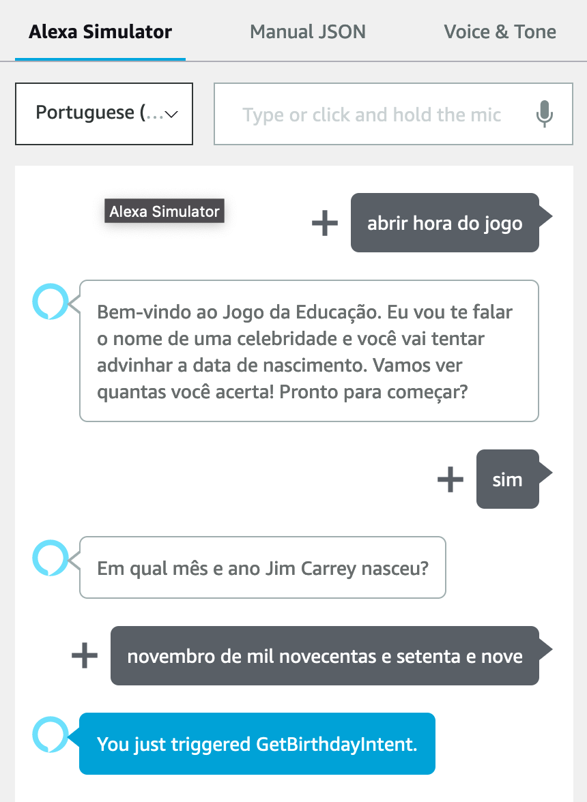
<br>

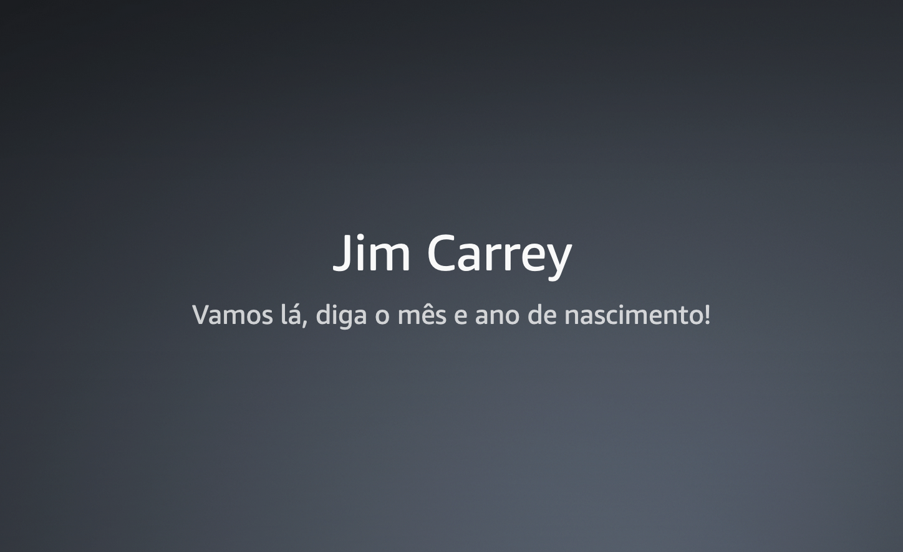
<br>

#### Adicione o `GetBirthdayIntentHandler` para receber dados da intent **GetBirthday**
<br>

56.  Na console do desenvolvedor, clique na guia **Code**.
<br>

57.  Abra o arquivo `lambda_function.py` e copie a classe **PlayGameHandlere** e cole algumas linhas abaixo, mas antes do início da classe **HelloWorldIntentHandler**.
<br>

58.  Altere **PlayGameHandler** para **GetBirthdayIntentHandler** no código recém-colado.
<br>

59.  Role para baixo até a lista de handlers no final do arquivo `lambda_function.py` adicione **GetBirthdayIntentHandler**, abaixo de **PlayGameHandler**
<br>

```
sb.add_request_handler(GetBirthdayIntentHandler())
```
<br>

60.  Em seguida, altere o método **can_handle()** do **GetBirthdayIntentHandler** para retornar **true** se a intenção for **GetBirthdayIntent**. Substitua o trecho de código abaixo;
<br>

```
and ask_utils.is_intent_name("AMAZON.YesIntent")(handler_input)
```
<br>

61.  Por este outro trecho de código;
<br>

```
and ask_utils.is_intent_name("GetBirthdayIntent")(handler_input)
```
<br>

62.  Role para baixo até a função **handle** e substitua o código abaixo;
<br>

```
from celebrityFunctions import get_random_celeb
celeb = get_random_celeb()
title = celeb["name"]
speak_output =  f'Em qual mês e ano {celeb["name"]} nasceu?'
```
<br>

63. Pelo seguinte trecho;
<br>

```
year = ask_utils.request_util.get_slot(handler_input, "year").value
month = ask_utils.request_util.get_slot(handler_input, "month").value
        
# Share the answer
speak_output = f'Sua resposta foi {month} de {year}. Quer tentar outra?'
```

<br>

64.  Desça até a seção APL e substitua esse código.
<br>

```
"Title": title,
"Subtitle": 'Vamos lá, diga o mês e ano de nascimento!',
```
<br>

65.  Pelo código abaixo;
<br>

```
"Title": f'{month} de {year}',
"Subtitle": 'Tentar de novo?',
```
<br>

66.  No canto superior direito da página da guia **Code,** clique em **Save** e, em seguida, clique em **Deploy** para implantar seu código. Teste sua habilidade novamente!
<br>
 
> Desafio: Permitir que o usuário informe somente os dois últimos dígitos do ano!
