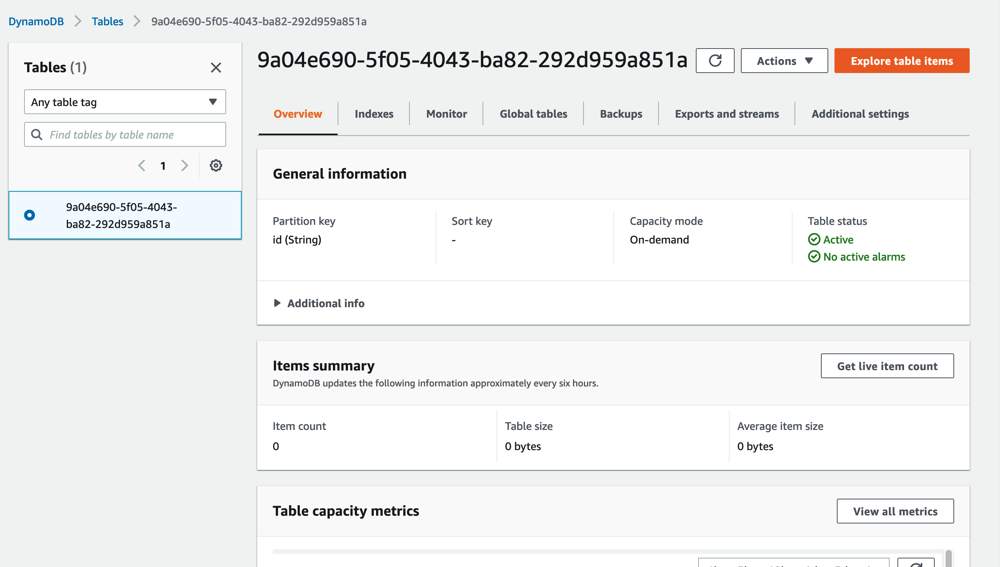
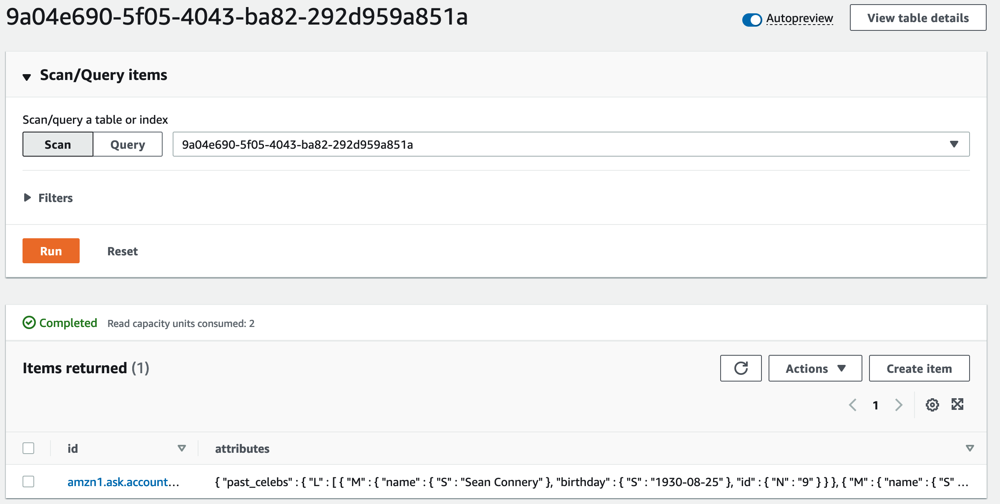
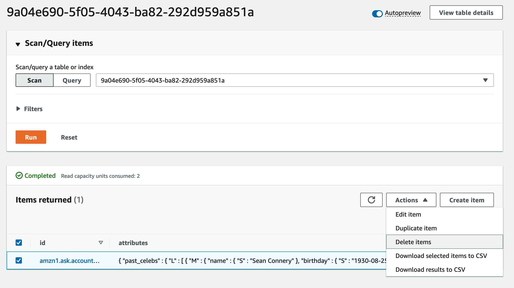

## Módulo 3 - Fazendo uso de atributos persistentes

O que você vai aprender neste módulo:

* Como usar atributos de sessão para salvar informações durante o jogo
* Como usar atributos persistentes para salvar informações entre jogos diferentes
* Como usar um **Request Interceptor** para tornar sua habilidade mais eficiente para gravar e ler dados entre sessões

>Atributos são tipos de memória disponíveis para sua habilidade. A lista a seguir mostra os três tipos:
>
>Atributo de solicitação : Informações armazenadas durante a duração de uma solicitação para que possam ser compartilhadas entre manipuladores e interceptadores e similares.
>
>Atributo da sessão : Informações armazenadas pelo sistema Alexa durante a sessão do cliente com sua skill, mas "esquecidas" quando a sessão termina. Você usa esses atributos com frequência.
>
>Atributo persistente : informações armazenadas em outro serviço como Amazon DynamoDB ou Amazon S3 e gerenciadas com adaptadores de persistência, que simplificam o armazenamento e a recuperação dos dados.

<br>

### Usar atributos de sessão,  lembre-se quais perguntas já foram feitas.
<br>

1. Na guia **Code,** arquivo `lambda_function.py`, localize a classe `PlayGameHandler`. 
<br>

2. Na função  `handle()`, substitua este código. 
<br>

```
from celebrityFunctions import get_random_celeb
celeb = get_random_celeb()
title = celeb["name"]
speak_output =  f'Em qual mês e ano {celeb["name"]} nasceu?'
```
<br>

3. Pelo código a seguir;
<br>

```
session_attributes = handler_input.attributes_manager.session_attributes
        
speak_output = ''

# check if there's a current celebrity. If so, repeat the question and exit.
if 'current_celeb' in session_attributes.keys() and session_attributes["current_celeb"] != None:
    speak_output = f'Em qual mês e ano {session_attributes["current_celeb"]["name"]} nasceu?'
    return (
        handler_input.response_builder
            .speak(speak_output)
            .ask(speak_output)
            .response
    )

# Check for past celebrities array and create it if not available
if 'past_celebs' not in session_attributes.keys():
    session_attributes["past_celebs"] = []

# Import the celebrity functions and get a random celebrity.
from celebrityFunctions import get_random_celeb
celeb = get_random_celeb(session_attributes["past_celebs"])
title = celeb["name"]
subtitle = 'Vamos lá, diga o mês e ano de nascimento!'

# Check to see if there are any celebrities left.
if celeb["id"] == 0:
    speak_output = 'Acabaram as celebridades. Obrigado por jogar!'
    title = 'Fim de Jogo'
    subtitle = ''
else:
    # set the "current_celeb" attribute
    session_attributes["current_celeb"] = celeb
    # save the session attributes
    handler_input.attributes_manager.session_attributes = session_attributes
    # Ask the question
    speak_output = f'Em qual mês e ano {session_attributes["current_celeb"]["name"]} nasceu?'
```
<br>

4. Na seção APL do arquivo `lambda_function.py`, substitua o código.
<br>

```
"Subtitle": 'Vamos lá, diga o mês e ano de nascimento!',
```
<br>

5. Pelo trecho abaixo;
<br>

```
"Subtitle": subtitle,
```
<br>


### Verifique a resposta e mantenha a pontuação
<br>

6. Encontre o método `handle()`da classe `GetBirthdayIntentHandler `no arquivo `lambda_function.py e` substitua-o pelo código a seguir. Adicionaremos novamente a resposta visual e o construtor de respostas mais para frente.
<br>

```
def handle(self, handler_input):
    # type: (HandlerInput) -> Response
    speak_output = ''
    # get the current session attributes, creating an object you can read/update
    session_attributes = handler_input.attributes_manager.session_attributes
    # if there's a current_celeb attribute but it's None, or there isn't one
    # error, cue them to say "yes" and end
    if (('current_celeb' in session_attributes.keys() and
        session_attributes["current_celeb"] == None) or
        'current_celeb' not in session_attributes.keys()):
        speak_output = "Hum não tem nenhuma pergunta ativa. Vamos tentar uma questão?"
        return (
            handler_input.response_builder
                .speak(speak_output)
                .ask(speak_output)
                .response
        )
    # Replace me in the next step
```
<br>

Este bloco de código carrega os atributos de sessão do gerenciador de atributos. Se não houver nenhum valor em `current_celeb`, o código retornará uma mensagem de erro e o jogo parará ali mesmo. No entanto, a mensagem de erro também faz uma pergunta para ajudar o usuário a responder "Sim" e ativar uma pergunta. Sempre que puder, não entregue apenas uma mensagem de erro, mas tente levar o usuário a dizer algo que melhorará a situação.
<br>


7. Substitua o comentário `Replace me in the next step` pelo código a seguir, colocando-o na parte inferior do método `handle()`. Este código verifica a resposta do usuário.
<br>

```
# Get the slot values
year = ask_utils.request_util.get_slot(handler_input, "year").value
month = ask_utils.request_util.get_slot(handler_input, "month").value

# Okay, check the answer
from celebrityFunctions import check_answer
winner = check_answer(
    session_attributes["current_celeb"],
    month,
    year
)
```

<br>

Com o código acima, você obtém os valores dos slots e os envia junto com a celebridade atual da sessão para a função `check_answer`. Se o nome do mês não for reconhecido ou o ano estiver abaixo de 100, o código retornará a condição de erro. Conforme observado anteriormente, a habilidade solicita que o usuário forneça o nome do mês e o nome completo do ano. Em seguida, a habilidade envia a resposta do usuário e o processamento é encerrado. Além disso, em ambos os casos anteriores, em vez de enviar um novo documento APL sobre o erro, qualquer documento APL atual permanece na tela.
<br>


8. Diretamente abaixo do código que você acabou de colar, copie e cole o seguinte código ainda dentro do método `handle()`. Este código é executado quando o usuário dá uma resposta válida.
<br>

```
# Add the celebrity to the list of past celebs.
# Store the value for the rest of the function,
# and set the current celebrity to None
session_attributes["past_celebs"].append(session_attributes["current_celeb"])
cname = session_attributes["current_celeb"]["name"]
session_attributes["current_celeb"] = None

# Let's now check if there's a current score. If not, initialize it.
if 'score' not in session_attributes.keys():
session_attributes["score"] = 0

# We'll need variables for our visual. Let's initialize them.
title = ''
subtitle = ''

# Did they get it?
if winner:
session_attributes["score"] = session_attributes["score"] + 1
title = 'Parabéns!'
subtitle = 'Quer tentar acertar outra?'
speak_output = f"Muito bom, acertou na mosca o nascimento de {cname}! Você está com " \
    f"{session_attributes['score']} pontos. Preparado para a próxima?"
else:
title = 'Ah não...resposta errada!'
subtitle = 'Quer tentar outra?'
speak_output = f"Xi, resposta errada. Este não é o mês e ano correto do nascimento de " \
    f"{cname}. Quem sabe na próxima. Pronto para a próxima pergunta?"

# store all the updated session data
handler_input.attributes_manager.session_attributes = session_attributes
#speak_output = f'Sua resposta foi {month} de {year}. Quer tentar de novo?'
#                            "Title": f'{month} de {year}',
#                            "Subtitle": 'Tentar de novo?',
```
<br>

Como a habilidade usou o nome da celebridade, independentemente da resposta do usuário estar certa, você adiciona o nome ao array `past_celebs`, copia o nome para uso no restante do código e limpa o valor de  `current_celeb`.
Em seguida, você inicializa uma variável de pontuação se não houver uma, verifica se a resposta está certa (verdadeiro) ou errada (falso) e processa a resposta de acordo. Anteriormente, o código usava valores codificados para o título e subtítulo no código APL. Agora você usa textos diferentes, então esses valores são substituídos por variáveis. Com tudo isso feito, você salva os atributos da sessão.
<br>


9. Diretamente abaixo do código que você acabou de colar, copie e cole o código a seguir. Este código responde ao usuário.
<br>

```
#====================================================================
# Add a visual with Alexa Layouts
#====================================================================

# Import an Alexa Presentation Language (APL) template
with open("./documents/APL_simple.json") as apl_doc:
    apl_simple = json.load(apl_doc)
    if ask_utils.get_supported_interfaces(
            handler_input).alexa_presentation_apl is not None:
        handler_input.response_builder.add_directive(
            RenderDocumentDirective(
                document=apl_simple,
                datasources={
                    "myData": {
                        #====================================================================
                        # Set a headline and subhead to display on the screen if there is one
                        #====================================================================
                        "Title": title,
                        "Subtitle": subtitle,
                    }
                }
            )
        )

return (
    handler_input.response_builder
        .speak(speak_output)
        .ask(speak_output)
        .response
)
```
<br>

10. Quando terminar, o código da sua classe `GetBirthdayIntentHandler` deve ficar assim.
<br>


```
class GetBirthdayIntentHandler(AbstractRequestHandler):
    """Handler for Skill Launch."""
    def can_handle(self, handler_input):
        # type: (HandlerInput) -> bool

        return (
        ask_utils.is_request_type("IntentRequest")(handler_input)
            and ask_utils.is_intent_name("GetBirthdayIntent")(handler_input)
        )

    def handle(self, handler_input):
        # type: (HandlerInput) -> Response
        speak_output = ''
        # get the current session attributes, creating an object you can read/update
        session_attributes = handler_input.attributes_manager.session_attributes
        # if there's a current_celeb attribute but it's None, or there isn't one
        # error, cue them to say "yes" and end
        if (('current_celeb' in session_attributes.keys() and
            session_attributes["current_celeb"] == None) or
            'current_celeb' not in session_attributes.keys()):
            speak_output = "Hum não tem nenhuma pergunta ativa. Vamos tentar uma questão?"
            return (
                handler_input.response_builder
                    .speak(speak_output)
                    .ask(speak_output)
                    .response
            )
        # Get the slot values
        year = ask_utils.request_util.get_slot(handler_input, "year").value
        month = ask_utils.request_util.get_slot(handler_input, "month").value
        
        # Okay, check the answer
        from celebrityFunctions import check_answer
        winner = check_answer(
            session_attributes["current_celeb"],
            month,
            year
        )
        
        # Add the celebrity to the list of past celebs.
        # Store the value for the rest of the function,
        # and set the current celebrity to None
        session_attributes["past_celebs"].append(session_attributes["current_celeb"])
        cname = session_attributes["current_celeb"]["name"]
        session_attributes["current_celeb"] = None
        
        # Let's now check if there's a current score. If not, initialize it.
        if 'score' not in session_attributes.keys():
            session_attributes["score"] = 0
        
        # We'll need variables for our visual. Let's initialize them.
        title = ''
        subtitle = ''
        
        # Did they get it?
        if winner:
            session_attributes["score"] = session_attributes["score"] + 1
            title = 'Parabéns!'
            subtitle = 'Preparado para a próxima pergunta?'
            speak_output = f"Muito bom, acertou na mosca o nascimento de {cname}! Você está com " \
                f"{session_attributes['score']} pontos. Preparado para a próxima?"
        else:
            title = 'Ah não...resposta errada!'
            subtitle = 'Quer tentar outra?'
            speak_output = f"Xi, errou! Este não é o mês e ano correto do nascimento de " \
                f"{cname}. Quem sabe na próxima. Pronto para a próxima pergunta?"
        
        # store all the updated session data
        handler_input.attributes_manager.session_attributes = session_attributes
        
        #====================================================================
        # Add a visual with Alexa Layouts
        #====================================================================
        
        # Import an Alexa Presentation Language (APL) template
        with open("./documents/APL_simple.json") as apl_doc:
            apl_simple = json.load(apl_doc)
            if ask_utils.get_supported_interfaces(
                    handler_input).alexa_presentation_apl is not None:
                handler_input.response_builder.add_directive(
                    RenderDocumentDirective(
                        document=apl_simple,
                        datasources={
                            "myData": {
                                #====================================================================
                                # Set a headline and subhead to display on the screen if there is one
                                #====================================================================
                                "Title": title,
                                "Subtitle": subtitle,
                            }
                        }
                    )
                )
        
        return (
            handler_input.response_builder
                .speak(speak_output)
                .ask(speak_output)
                .response
        )
```
<br>

11. No canto superior direito da página da guia **Code, clique em** **Save** e em seguida, clique em **Deploy.** Teste o seu código!
<br>

### Usar atributos persistentes entre jogos
<br>

Em sua forma mais básica, a diferença entre atributos de sessão e atributos persistentes é quanto tempo eles duram. Os atributos de sessão duram até o final da sessão, mas os atributos persistentes persistem além do final da sessão.
<br>

À medida que seu jogo fica mais complexo e armazena dados mais complexos, pode ser necessário compartilhá-lo com outras ferramentas e serviços ou você pode querer apenas o poder de um banco de dados. Neste workshop, você aprenderá a usar o [adaptador de persistência do Amazon DynamoDB](https://developer.amazon.com/en-US/docs/alexa/hosted-skills/alexa-hosted-skills-session-persistence.html).
<br>

12. No console do desenvolvedor, na página da guia **Code**, no menu à esquerda clique no arquivo `requirements.txt`. 
<br>

13. Copie e cole o código a seguir para carregar seu adaptador de persistência.
<br>

```
ask-sdk
ask-sdk-dynamodb-persistence-adapter==1.15.0
```
<br>

14. Clique em **Save** e depois **Deploy**, clique em **Implantar** para implantar seu código.
<br>

15. No arquivo `lambda_function.py`, na parte superior do arquivo, localize o código a seguir. 
<br>

```
import logging
import ask_sdk_core.utils as ask_utils
import json
from ask_sdk_model.interfaces.alexa.presentation.apl import (
    RenderDocumentDirective)
```
<br>

16. Imediatamente após esse código, cole o código abaixo
<br>

```
import os
import boto3
import json

from ask_sdk.standard import StandardSkillBuilder
from ask_sdk_dynamodb.adapter import DynamoDbAdapter
from ask_sdk_core.dispatch_components import AbstractRequestInterceptor
from ask_sdk_core.dispatch_components import AbstractResponseInterceptor

# are you tracking past celebrities between sessions
CELEB_TRACKING = True
```
<br>

17. Desça até o final do arquivo e encontre o trecho abaixo de código;
<br>

```
sb = SkillBuilder()
```
<br>

18. E substitua pelo seguinte código;
<br>

```
sb = StandardSkillBuilder(
    table_name=os.environ.get("DYNAMODB_PERSISTENCE_TABLE_NAME"), auto_create_table=False)
```
<br>


> **Dica:** se você quiser usar sua própria tabela do DynamoDB em seus próprios recursos da AWS (em vez de hospedados pelo Alexa), consulte as [opções de configuração do adaptador de persistência do DynamoDB](https://developer.amazon.com/en-US/docs/alexa/alexa-skills-kit-sdk-for-python/manage-attributes.html) na documentação do Alexa Skills Kit. Caso contrário, essa habilidade usa uma tabela que a Amazon provisionou para você quando você criou sua habilidade hospedada pelo Alexa. 
<br>


### Crie interceptores para facilitar o manuseio dos atributos
<br>

19. Role até o final do arquivo `lambda_function.py` e localize a linha a seguir;
<br>

```
sb.add_exception_handler(CatchAllExceptionHandler())
```
<br>

20. Cole o código a seguir abaixo para registrar 2 interceptadores de solicitação e 2 interceptadores de resposta.
<br>

```
# Interceptors
sb.add_global_request_interceptor(LoadDataInterceptor())
sb.add_global_request_interceptor(LoggingRequestInterceptor())

sb.add_global_response_interceptor(SaveDataInterceptor())
sb.add_global_response_interceptor(LoggingResponseInterceptor())
```
<br>


Este novo código executa as seguintes tarefas:

* Antes de executar os handlers de solicitação, o `LoadDataInterceptor` e `LoggingRequestInterceptor` são executados.
* Depois que o handler escolhido retornar seu resultado, o `SaveDataInterceptor` e o `LoggingResponseInterceptor` serão executados.

21. Localize a classe `CatchAllExceptionHandler` e cole o código antes da classe;
<br>

```
class LoadDataInterceptor(AbstractRequestInterceptor):
    """Check if user is invoking skill for first time and initialize preset."""
    def process(self, handler_input):
        # type: (HandlerInput) -> None
        persistent_attributes = handler_input.attributes_manager.persistent_attributes
        session_attributes = handler_input.attributes_manager.session_attributes

        # ensure important variables are initialized so they're used more easily in handlers.
        # This makes sure they're ready to go and makes the handler code a little more readable
        if 'current_celeb' not in session_attributes:
            session_attributes["current_celeb"] = None

        if 'score' not in session_attributes:
            session_attributes["score"] = 0

        if 'past_celebs' not in persistent_attributes:
            persistent_attributes["past_celebs"] = []

        if 'past_celebs' not in session_attributes:
            session_attributes["past_celebs"] = []

        # if you're tracking past_celebs between sessions, use the persistent value
        # set the visits value (either 0 for new, or the persistent value)
        session_attributes["past_celebs"] = persistent_attributes["past_celebs"] if CELEB_TRACKING else session_attributes["past_celebs"]
        session_attributes["visits"] = persistent_attributes["visits"] if 'visits' in persistent_attributes else 0

class LoggingRequestInterceptor(AbstractRequestInterceptor):
    """Log the alexa requests."""
    def process(self, handler_input):
        # type: (HandlerInput) -> None
        logger.debug('----- REQUEST -----')
        logger.debug("{}".format(
            handler_input.request_envelope.request))
```
<br>

O primeiro interceptor de solicitação, LoadDataInterceptor, executa a seguinte tarefa. Se a variável `CELEB_TRACKING` tiver o valor verdadeiro, o valor armazenado (persistido na tabela do DynamoDB) das celebridades anteriores é carregado para a variável da sessão.
<br>

O segundo interceptor de solicitação, `LoggingRequestInterceptor`, simplesmente registra em log a solicitação recebida no Amazon CloudWatch.
<br>


22. Abaixo do bloco de código adicionado anteriormente, cole o código a seguir.

```
class SaveDataInterceptor(AbstractResponseInterceptor):
    """Save persistence attributes before sending response to user."""
    def process(self, handler_input, response):
        # type: (HandlerInput, Response) -> None
        persistent_attributes = handler_input.attributes_manager.persistent_attributes
        session_attributes = handler_input.attributes_manager.session_attributes

        persistent_attributes["past_celebs"] = session_attributes["past_celebs"] if CELEB_TRACKING  else []
        persistent_attributes["visits"] = session_attributes["visits"]

        handler_input.attributes_manager.save_persistent_attributes()

class LoggingResponseInterceptor(AbstractResponseInterceptor):
    """Log the alexa responses."""
    def process(self, handler_input, response):
        # type: (HandlerInput, Response) -> None
        logger.debug('----- RESPONSE -----')
        logger.debug("{}".format(response))
```
<br>

O primeiro interceptor (classe `SaveDataInterceptor)`, verifica a variável `CELEB_TRACKING`. Se o valor for verdadeiro, os valores da variável `past_celebs` da sessão são copiadas para a variável persistente e em seguida, escritas na tabela.
<br>

O segundo interceptor de resposta, `LoggingResponseInterceptor`, simplesmente registra a solicitação de entrada que pode ser encontrada posteriormente no Amazon CloudWatch.
<br>

### Atualize como você abre sua skill para dar as boas-vindas aos usuários recorrentes

23. No arquivo `lambda_function.py`, role até quase o topo do arquivo e encontre a classe `LaunchRequestHandler`. 
    Como o `LoadDataInterceptor` inicializou as variáveis, você precisa extrair os atributos da sessão e, em seguida, customizar a saudação. 
<br>

24. Substitua o código a seguir.
<br>
```
speak_output =  f"Bem-vindo ao Jogo da Educação. " \
            f"Eu vou te falar o nome de uma celebridade e " \
            f"você vai tentar advinhar a data de nascimento. " \
            f"Vamos ver quantas você acerta! " \
            f"Pronto para começar? "
```
<br>

25. Pelo trecho abaixo;
<br>

```
speak_output = ''
session_attributes = handler_input.attributes_manager.session_attributes

if session_attributes["visits"] == 0:
    speak_output =  f"Bem-vindo ao Jogo da Educação. " \
        f"Eu vou te falar o nome de uma celebridade e " \
        f"você vai tentar advinhar a data de nascimento. " \
        f"Vamos ver quantas você acerta! " \
        f"Pronto para começar? "
else:
    speak_output = f"Bem-vindo de volta à hora do jogo! " \
        f"Pronto para acertar a data de nascimento de mais celebridades?"
```

<br>
Com este novo código, você pode escolher qual saudação usar com base no número de visitas. Você pode fazer com que a skill informe aos usuários sua pontuação atual e sua posição na tabela de classificação. Você pode até ter um bônus diário que os usuários podem ganhar voltando à habilidade todos os dias.
<br>


### Atualize seu verificador de respostas para lembrar os valores de `past_celebs` no longo prazo
<br>

26.  No arquivo `lambda_function.py`, localize a classe `PlayGameHandler`. 
<br>

27. Substitua o código a seguir. 
<br>

```
if 'current_celeb' in session_attributes.keys() and session_attributes["current_celeb"] != None:
```
<br>

28. Pelo código abaixo:
<br>

```
if session_attributes["current_celeb"] != None:
```
<br>

Você não precisa verificar se esse atributo existe porque você tratou isso na classe `LoadDataInterceptor`, inicializando a variável past_celebs.
<br>


29. Comente ou exclua o código a seguir. O interceptor também já fez este trabalho para você.
<br>

```
# Check for past celebrities array and create it if not available
if 'past_celebs' not in session_attributes.keys():
    session_attributes["past_celebs"] = [];
```
<br>

30. Agora, desça até a classe `GetBirthdayIntentHandler` e encontre o código abaixo.
<br>

```
if (('current_celeb' in session_attributes.keys() and
    session_attributes["current_celeb"] == None) or
    'current_celeb' not in session_attributes.keys()):
```
<br>

31. Substitua pelo seguinte código:
<br>

```
if session_attributes["current_celeb"] == None:
```
<br>

32. Desça mais um pouco e exclua ou comente o código a seguir.
<br>

```
# Let's now check if there's a current score. If not, initialize it.
        if 'score' not in session_attributes.keys():
            session_attributes["score"] = 0
```
<br>


### Verifique seus dados no DynamoDB
<br>

33.  Clique na guia **Code** e na barra superior, clique em **DynamoDB Database**. A página inicial do DynamoDB tem duas seções principais. 
<br>

34.  À esquerda, localize o ID da sua tabela na coluna com uma lista de tabelas. O serviço seleciona sua tabela por padrão.
<br>



<br>

35.  À direita, clique em **Explore table items** para visualizar a lista de registros.
<br>


<br>

Você deve ter apenas um registro porque o DynamoDB chaveia cada registro para um ID exclusivo para um cliente.
<br>

No lado esquerdo da visualização da guia Itens, na coluna id, observe a string de código exclusiva. O DynamoDB criou esse código para o relacionamento da conta do cliente com essa skill. Se você desabilitar a skill e habilitá-la novamente, o serviço cria um novo ID. 
<br>

À direita da coluna id, na coluna atributos, visualize o registro gravado. Neste caso, o usuário respondeu a uma pergunta sobre o ator Sean Connery. 
<br>

### Para fins de teste, você pode querer limpar seus dados e começar de novo. 
<br>

36. Para limpar seus dados e recomeçar, na guia **Items returned**, marque a caixa de seleção ao lado de seu **id**. 
<br>

37. No menu **Actions**, selecione **Delete items.**
<br>



<br>

>Desafio: Acumular a pontuação e informá-la na etapa de boas vindas!
<br>

